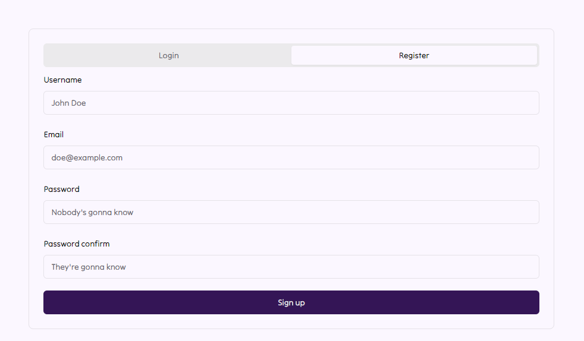
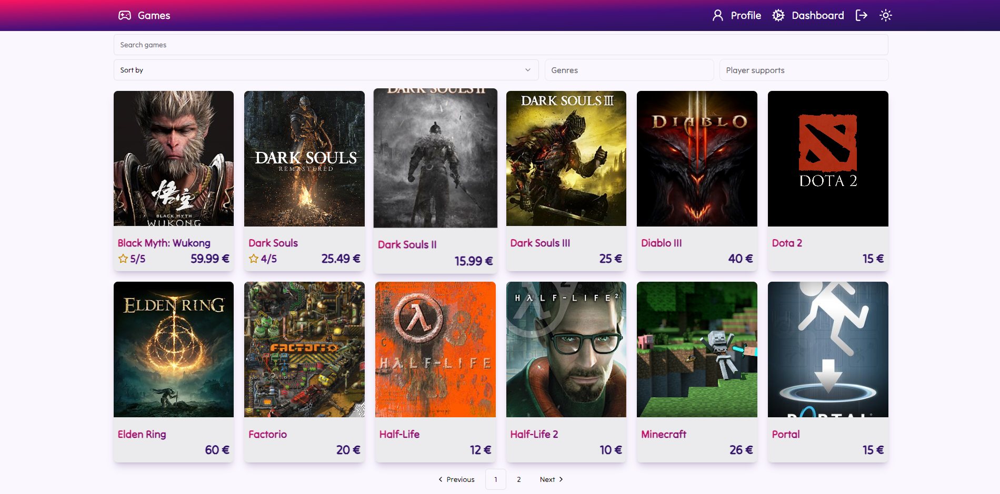
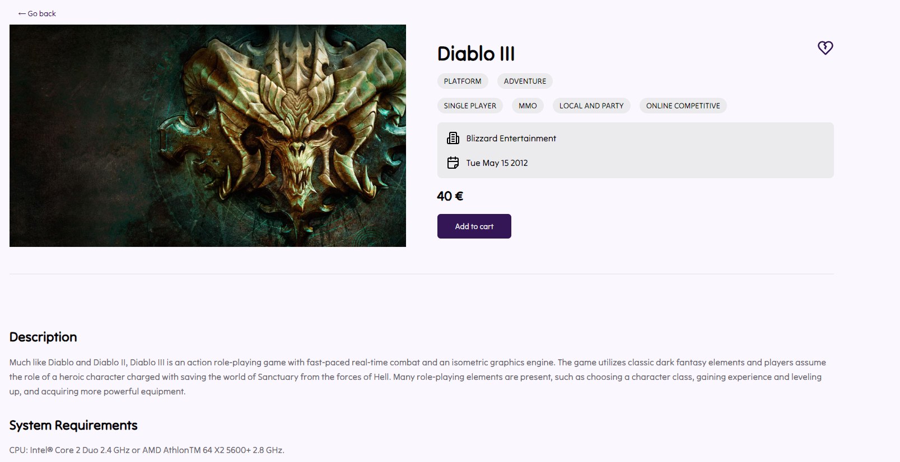
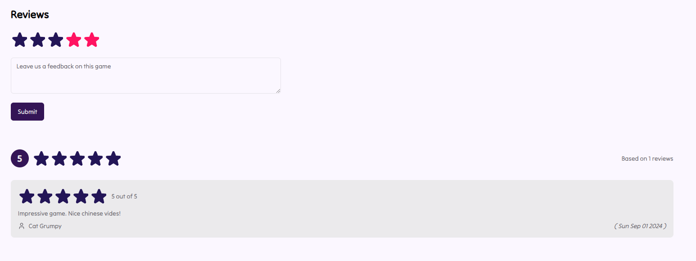
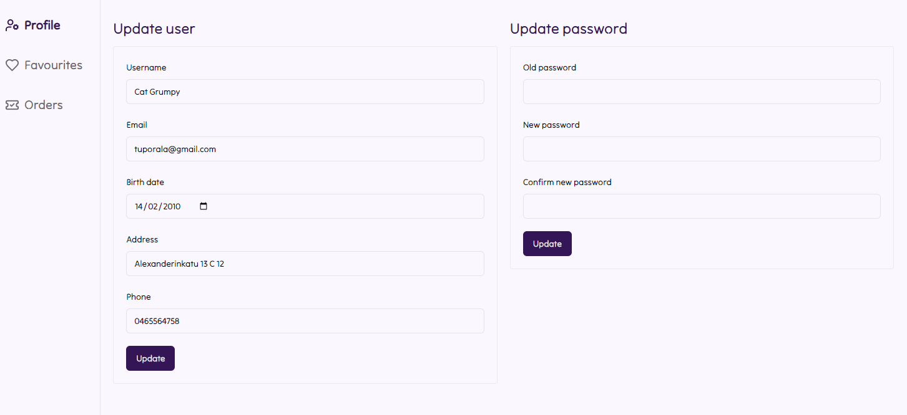
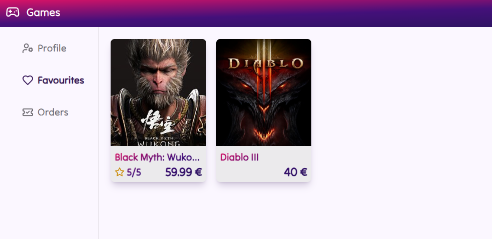
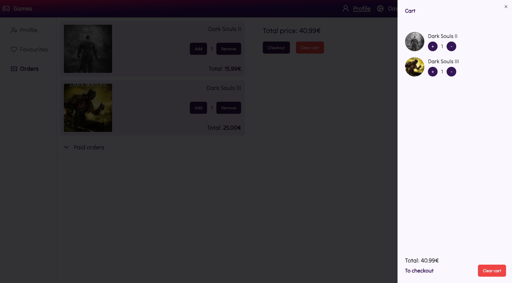
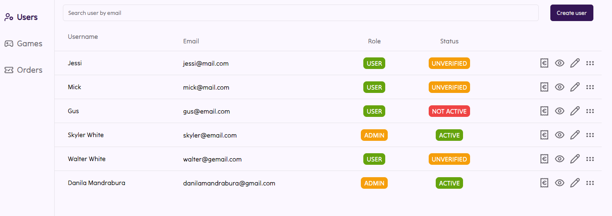
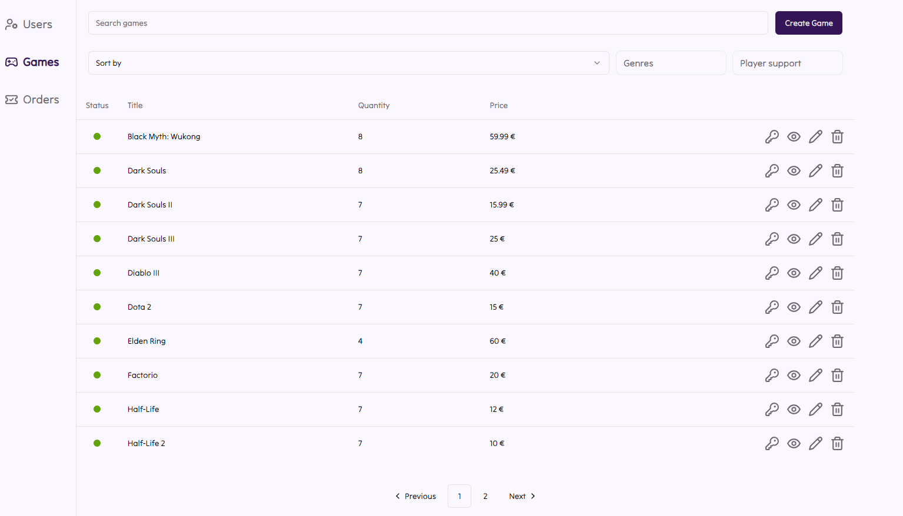
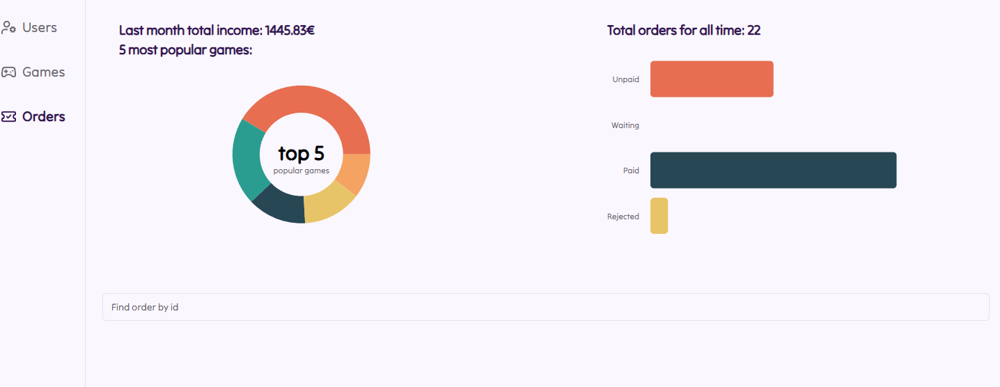

# Fake Game Store App

## Description

This project is a frontend for asignment of Integrify Academy Full Stack course.
The task was to create an ecommerce website and games' keys store was a pick for that.
This project only works with the [backend](https://github.com/Redmoor19/fs18_java_backend).
Fake Game App is a non-profitable study project without actual products. All data is mocked and keys are faked using UUID.

During this project I learned how to build complex ecommerce React application with server state, authentication and role based access. The deadlines for the assignment were tight and it helped to hone a skill of producing good code in limited amount of time. UI was implemented using [Shadcn/UI](https://ui.shadcn.com/). Usage and features will be listed below.

## Table of Contents

- [Installation](#installation)
- [DevStack](#devstack)
- [Usage](#usage)
- [Credits](#credits)
- [License](#license)

## Installation

- Fork this repository and clone your fork to local machine
- Pull all the data from your fork
- `npm install`
- `npm run dev`
  (To run this project you need to connect to backend, otherwise fetching won't work)

## DevStack

This project was implemented using React and following packeges:

- [Axios](https://www.npmjs.com/package/axios) for fetching data from the server
- [Shadcn/UI](https://ui.shadcn.com/) for UI/UX
- [React-Router-Dom](https://reactrouter.com/en/main) for routing
- [TailwindCss](https://tailwindcss.com/) for styling
- [React-Hook-Form](https://react-hook-form.com/) for managing forms
- [Zod](https://zod.dev/) for form validation

## Usage

### User features

- Registration and login (account verification with email coming to your email address)
  ```md
  
  
  ```
- Games explore with sorting, pagination and search. Check game information and leave reviews.
  ```md
  
  
  
  ```
- Profile with updating information, favourite games and cart (order checkout with sending email with purchased keys).
  ```md
  
  
  
  ```

### Admin features

- Dashboard with an access to user create, update, soft delete
  ```md
  
  ```
- Dashboard with an access to games create, update, add keys, soft delete
  ```md
  
  ```
- Dashboard with an access to orders statistics and users information
  ```md
  
  ```

## Credits

Project was created by my own as an assignment to [Integrify Academy](https://www.integrify.io/)

## License

This project was created for study purposes only. You can copy, edit and contribute to it. No commercial use.
